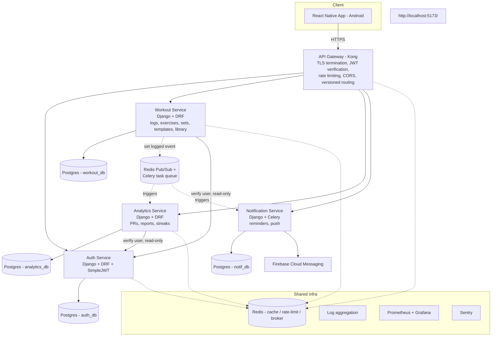

# Technical Requirements Document (TRD)
**Product:** LOADED — Workout Tracker (v2.0)
**Status:** Draft for review
**Last updated:** 2026-07-25

---

## 1. Stack decisions

Two choices were left to my judgment (per your instructions); rationale below so you can override before we build.

### 1.1 Frontend: **React Native (with Expo)**

| | React Native | Flutter |
|---|---|---|
| Reuses prototype knowledge | Yes — prototype is React/JSX, same component/hook mental model | No — new language (Dart) |
| Existing dependency hint | `loaded-app/package.json`'s `node_modules` already has `@reduxjs/toolkit` installed, suggesting Redux Toolkit was the intended state layer | — |
| OTA hotfixes | Expo/EAS Update — ship JS fixes without a Play Store review cycle | Requires a full store release |
| Custom animated UI (plate-fill bar, chip transitions) | Fully achievable with Reanimated + SVG | Natively excellent (Skia) — the one area Flutter is arguably stronger |
| Ecosystem for Google Sign-In, FCM, charts | Mature, first-party or well-maintained libraries | Also mature |

**Decision: React Native + Expo (managed workflow, "prebuild" as needed for native modules).** The deciding factor is continuity with the existing prototype and codebase, not a claim that Flutter is worse — flag this now if you'd rather standardize on Flutter.

### 1.2 Database: **PostgreSQL** (primary, one logical database per service) + **Redis** (cache, rate-limit counters, Celery broker)

Rationale: relational integrity matters here (a `SetEntry` without its `Exercise`/`WorkoutDay` is meaningless — foreign keys should be enforced, not hoped for), Django's ORM is built around it, managed Postgres is available on every major cloud, and it comfortably supports the database-per-service pattern needed for the microservice split below. SQLite (used by the prototype) is dev-only from here on.

### 1.3 Other stack choices

| Concern | Choice | Why |
|---|---|---|
| Backend framework | Django + Django REST Framework, one Django project per service | Matches your specified backend; DRF gives serializer-based validation for free |
| Auth tokens | JWT (access + refresh), `djangorestframework-simplejwt` | Stateless, works cleanly across services behind a gateway |
| OAuth/SSO | Google Sign-In via `google-auth` token verification on the backend; app performs native Google sign-in and sends the ID token | Matches your selection (email/password + Google) |
| API Gateway | Kong (open-source) | Centralizes rate limiting, CORS, JWT verification, and versioned routing in one place instead of reimplementing it per service |
| Inter-service async | Celery + Redis (broker) for background jobs (notifications, report rollups); lightweight event publishing over Redis Pub/Sub for cross-service triggers (e.g. "set logged" → analytics/streak update) | Simple, Django-native, avoids standing up Kafka/RabbitMQ for a v2.0 workload |
| Containerization | Docker; Kubernetes for orchestration (matches your "public production scale" choice) | Each service ships as its own image; K8s gives rolling deploys, autoscaling, self-healing |
| CI/CD | GitHub Actions → build/test/push image → deploy to cluster | Standard, free for reasonable usage |
| Push notifications | Firebase Cloud Messaging (Android) | Free, standard for Android; also positions cleanly for iOS later via the same Firebase project |
| Object storage | S3-compatible bucket (exercise demo images, user avatars) | Keeps binary assets out of Postgres and off app servers |
| Observability | Structured JSON logs → centralized log aggregation (Loki or cloud-native equivalent); Prometheus + Grafana for metrics; Sentry for error tracking | Required per your ask for "logs"; this is the production-grade version of that |

## 2. Architecture overview

### 2.1 Service boundaries and why they're split this way

- **Auth Service** — the only service that owns credentials, sessions, and OAuth. Every other service trusts a verified JWT (signature checked at the gateway) rather than calling Auth synchronously on every request — Auth is only queried directly for things like "does this user still exist / is this account active" on sensitive operations.
- **Workout Service** — the core write-heavy domain: `WorkoutDay`, `Exercise`, `SetEntry`, the exercise library, and templates. This is deliberately one service, not split further (e.g. "exercise library" is *not* its own service) — splitting reference data that's always read alongside the log itself would add network calls with no independent scaling or ownership benefit. Revisit only if the library grows a genuinely separate team/release cycle.
- **Analytics Service** — read-heavy, derived data: PRs, weekly/monthly reports, streaks. Kept separate from Workout because its access pattern (aggregation queries across a user's whole history) and scaling profile (benefits from caching, could later move to a read replica or a columnar store) differs from Workout's OLTP-style writes. It consumes "set logged" / "day saved" events rather than being queried synchronously by Workout on every write, so a slow analytics recompute never blocks a save.
- **Notification Service** — isolates all Celery scheduling and third-party push delivery (FCM). Notification delivery failures or FCM outages should never affect logging or reporting.
- **API Gateway** — single point for cross-cutting concerns (§4) so they're enforced consistently instead of re-implemented (and potentially forgotten) in each service.

This is 4 services + a gateway, not 10 — deliberately. "Microservices" here means *independently deployable, independently owned data, clear domain boundaries*, not maximal fragmentation. Given this is a single-developer build, over-splitting increases operational cost for no real benefit; this is the smallest split that gives you genuine service independence.

## 3. Cross-cutting requirements (from your explicit ask)

| Requirement | Implementation |
|---|---|
| **OAuth / SSO** | Email+password (Argon2 password hashing) and Google Sign-In, both issuing the same internal JWT pair. See [05-BACKEND-SCHEMA.md](05-BACKEND-SCHEMA.md) §Auth Service for token/claims shape. |
| **Input validation** | DRF serializers with explicit field constraints on every service (never trust client-supplied IDs/ownership — always scope queries to `request.user`). Gateway also rejects malformed requests (wrong content-type, oversized payloads) before they reach a service. |
| **Rate limiting** | Two layers: Kong rate-limiting plugin at the gateway (per-IP and per-authenticated-user limits, tuned per route — e.g. auth endpoints get tighter limits than read endpoints) + DRF `Throttle` classes inside each service as defense-in-depth if a service is ever reached directly. |
| **CORS configuration** | `django-cors-headers` per service with an explicit allow-list of the app's origin(s) — no `CORS_ALLOW_ALL_ORIGINS=True` in production (the prototype's dev-only default). Since the client is a native app (not a browser), CORS mainly matters for the admin/gateway surface and any future web client; configured narrowly regardless. |
| **API versioning** | URL-path versioning: `/api/v1/...` per service, routed by the gateway. A breaking change ships as `/api/v2/...` alongside `v1` until the app has migrated, then `v1` is deprecated on a published timeline — never a silent breaking change. |
| **Logs** | Structured JSON logs (request id, user id if authenticated, service name, latency, status) from every service, shipped to a central aggregator. Request IDs are generated at the gateway and propagated through headers so one user action can be traced across services. |

## 4. Non-functional requirements

- **Availability target:** 99.5% for the core log-and-save path (the single most important user action). Lower bar acceptable for analytics/notifications (best-effort, can lag by seconds/minutes without harming the core experience).
- **Latency:** p95 < 300ms for `PUT` workout day save (this is the "in the gym, between sets" critical path — it must feel instant).
- **Data durability:** daily automated Postgres backups per service DB, point-in-time recovery enabled on the managed DB provider.
- **Security baseline:** HTTPS everywhere (TLS terminated at the gateway/load balancer), secrets in a managed secrets store (not env files in source control — the prototype's `.env.example` pattern continues, but real values never touch the repo), dependency vulnerability scanning in CI.
- **Offline tolerance (client):** the app must queue a set update locally and retry on reconnect rather than silently failing — this was flagged as a product requirement in the PRD (§7) and has direct backend implications (idempotent upserts, which the existing `WorkoutDaySerializer.create` upsert pattern already supports and v2.0 should preserve).

## 5. Deployment topology (public production scale)

- Managed Kubernetes (e.g. GKE/EKS) with one Deployment + Service per microservice, autoscaling on CPU/request-count.
- Managed Postgres (e.g. Cloud SQL/RDS) — one instance per service to start is acceptable if cost-sensitive; the requirement is *logical* separation (separate database, separate credentials, no cross-service foreign keys) so instances can be physically split later without a data-model change.
- Managed Redis (e.g. Memorystore/ElastiCache) shared across services for cache/rate-limit/broker use — this one is fine to share since it holds no durable service-owned data.
- Kong deployed as the cluster ingress.
- CI/CD: GitHub Actions builds and pushes per-service images on merge to `main`, deploys via a Kubernetes manifest/Helm chart per environment (staging, production).

## 6. Environments

`local` (Docker Compose, all services + Postgres + Redis on one machine) → `staging` (mirrors production topology, smaller resource requests) → `production`.

## 7. Cross-service account deletion (flagged from PRD §8)

Because user data is split across `auth_db`, `workout_db`, `analytics_db`, and `notif_db`, deleting an account is a distributed operation, not a single `DELETE`. Approach: Auth Service marks the account `deleted` immediately (login blocked instantly) and publishes an `account_deleted` event; each other service subscribes and purges/anonymizes its own user-scoped data, with a dead-letter/retry mechanism so a temporarily-down service doesn't leave orphaned data permanently. This needs an explicit SLA (e.g. "fully purged within 30 days") — flagging as an open question below.

## 8. Open questions for review

1. Cloud provider preference (AWS / GCP / Azure), or should I pick one and justify it in the implementation plan? This affects exact managed-service names above (RDS vs Cloud SQL, etc.) but not the architecture itself.
2. Confirm the account-deletion SLA mentioned in §7 (e.g. 30 days) so it can be stated in the privacy-facing product copy later.
3. Any existing domain name / desire to self-host vs. use a platform like Railway/Render for a lighter-ops start before graduating to full Kubernetes? (Kubernetes from day one is what "public production scale" implies, but it's fair to phase it — see [06-IMPLEMENTATION-PLAN.md](06-IMPLEMENTATION-PLAN.md).)

---
**Previous:** [01-PRD.md](01-PRD.md) · **Next:** [03-APP-FLOW.md](03-APP-FLOW.md)
