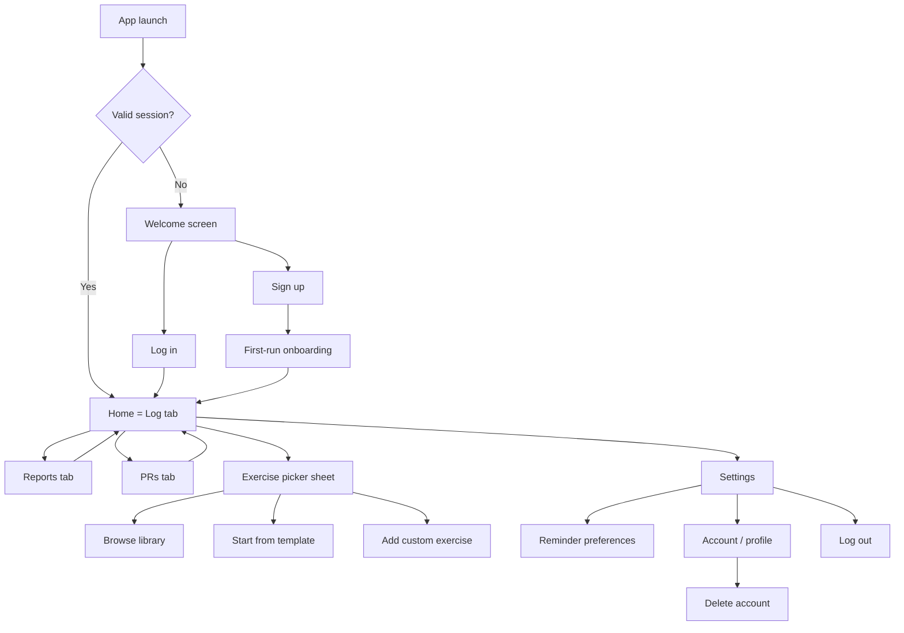

# App Flow
**Product:** LOADED — Workout Tracker (v2.0)
**Status:** Draft for review
**Last updated:** 2026-07-25

This document maps every screen and the transitions between them. It extends the prototype's three-tab flow (Log / Reports / PRs) with auth, templates, exercise library, streaks, and reminders. UI treatment for each screen is in [04-UI-UX-DESIGN-BRIEF.md](04-UI-UX-DESIGN-BRIEF.md); data shapes are in [05-BACKEND-SCHEMA.md](05-BACKEND-SCHEMA.md).

## 1. Top-level map

## 2. Screen-by-screen

### 2.1 Welcome (unauthenticated)
- Brand mark, tagline, two primary actions: **Continue with Google**, **Sign up with email**. Secondary link: **Log in** (for existing email accounts).
- No content behind this screen is reachable without a valid session — this is a hard gate, not a skip-able splash.

### 2.2 Sign up (email)
- Fields: email, password, confirm password. Client-side validation mirrors server rules (min length, not-common-password) so errors surface before submit, not just after.
- On success: account created (unverified), JWT issued immediately (email verification is a background nudge, not a login blocker — see open question in PRD §9 if you want to change this), routes to Onboarding.
- Errors surfaced inline (e.g. "email already registered" → offer a Log in link instead of a dead-end).

### 2.3 Log in (email)
- Fields: email, password. "Forgot password?" link → triggers reset-email flow (out of this diagram's detail, standard token-link-to-new-password pattern).
- On success → Home.

### 2.4 Google Sign-In
- Native Google account picker → backend verifies ID token → creates account if first time (skips straight to Onboarding) or logs in existing account (→ Home).

### 2.5 First-run onboarding (new accounts only)
- 2–3 short screens: (1) how tagging a day works, (2) how logging a set works, (3) optional: enable reminders (opt-in toggle, not forced). Skippable at every step.
- Ends on Home with the day genuinely empty (no seeded dummy data, unlike the prototype's `DUMMY_DAYS`).

### 2.6 Home / Log tab (the core loop — carried over from prototype, see [App.jsx](../../workout%20application/loaded-app/src/App.jsx) `LogTab` for the validated interaction model)
- Date navigator (‹ Day name / date ›), defaults to today.
- Streak indicator (new in v2.0) shown near the date header — current consecutive logging streak.
- Tag selector (Push/Pull/Legs/Upper/Lower/Full Body) — unchanged from prototype.
- "Today's load" card: live volume total + calorie estimate + exercise count, unchanged visual pattern.
- Exercise list, each with its sets (weight, reps, done-checkbox), add-set affordance — unchanged.
- Empty state → **Add exercise** opens the Exercise Picker sheet.
- All mutations save via the same optimistic-update-then-persist pattern as the prototype's `updateDay`, but now against per-user, authenticated endpoints, with an offline queue (TRD §4) instead of fire-and-forget.

### 2.7 Exercise Picker (bottom sheet)
Three entry points, new structure vs. the prototype's flat hardcoded list:
- **Browse library** — search/filter by name or muscle group, tag-filtered by the day's active tag by default (same UX intent as prototype's `CATALOG[tag]` default filtering).
- **Start from template** — lists the user's saved templates; picking one adds all its exercises at once with empty sets, replacing/appending to the current day's list (user chooses which via a confirm step if the day isn't empty).
- **Add custom** — free-text name, same as the prototype's custom-input row; saved as a user-scoped library entry so it's reusable/searchable next time (this upgrades the prototype's throwaway custom entry into something persistent).

### 2.8 Save current day as template
- Reachable from the Log tab (e.g. overflow menu on the day). Prompts for a template name, stores the exercise list (names + order only, no weights/reps/dates).

### 2.9 Reports tab
- Range selector: **Week / Month** (new — prototype was week-only).
- Stat cards: kcal spent, sessions — unchanged.
- Volume-by-day bar chart — unchanged for week view; month view aggregates by week instead of by day.
- Tag split donut — unchanged.
- New: **Per-exercise progress** — tapping an exercise anywhere (PRs tab or a new "exercises" link) opens a line chart of best weight over time for that exercise.

### 2.10 PRs tab
- Same card layout as the prototype (tag dot, name, date, weight×reps, trend badge) — unchanged visual/interaction model, now scoped per user and tappable into per-exercise progress (§2.9).

### 2.11 Settings
- Reminder preferences: enable/disable, day/time picker.
- Account: email, change password, linked Google account status.
- Delete account: explicit confirmation step (type-to-confirm or equivalent friction), states clearly what is deleted and references the deletion SLA from TRD §7.
- Log out.

## 3. Offline / error states (apply across §2.6–2.9)

- Save failure (no network): change is kept locally, a small non-blocking indicator shows "will sync when back online" rather than an error dialog — logging must never feel blocked by connectivity, consistent with PRD §7's reliability requirement.
- Save conflict (rare — same day edited on two devices while offline): last-write-wins with the existing upsert semantics, acceptable for a single-user-per-account product; flagged here in case you want a stricter merge behavior later.

## 4. Open questions for review

1. Should email verification block login, or is "log in immediately, verify in background" (as drafted in §2.2) the right call?
2. On "start from template" when the day already has exercises logged, should it always ask append-vs-replace, or default to append?

---
**Previous:** [02-TRD.md](02-TRD.md) · **Next:** [04-UI-UX-DESIGN-BRIEF.md](04-UI-UX-DESIGN-BRIEF.md)
